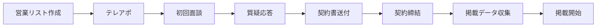

# 業務フロー一覧

---

## BF-01: 工務店営業フロー

| ステップ | 担当 | 使用資料 | SLA |
|---------|------|---------|-----|
| テレアポ | 営業 | テレアポスクリプト_v2 | 20件/日 |
| 初回面談 | 営業 | 工務店向け説明pptx + 料金プランdocx | - |
| 質疑応答 | 営業 | 工務店FAQ_MVP版 + 営業FAQ反論対応集 | - |
| 契約書送付 | 営業/代表 | 掲載契約書テンプレート | 面談後3日以内 |
| 掲載データ収集 | 営業 | ポータルサイトヒアリングシート | 契約後1週間 |

---

## BF-02: 見学会予約対応フロー

| # | タイミング | アクション | 担当 |
|---|-----------|-----------|------|
| 1 | 即時 | フォーム送信→DB保存 | システム |
| 2 | 即時 | 工務店へメール自動通知 | システム |
| 3 | 5分以内 | 通知確認 + リード管理表記録 | 営業 |
| 4 | 前日17:00 | リマインド確認 | 営業 |
| 5 | 見学会後 | アンケート送信 | 営業 |
| 6 | 月末 | 予約件数集計 | PM |
| 7 | 翌月3営業日 | freee請求書作成・発行 | 経理 |

---

## BF-03: 無料相談対応フロー

| # | SLA | アクション | 担当 |
|---|-----|-----------|------|
| 1 | 24h以内 | 相談申込受領→初回連絡 | 営業 |
| 2 | 72h以内 | ビルダーマッチング（スコアリング） | PM |
| 3 | 即時 | ビルダーへ紹介（Smart Match情報付き） | 営業 |
| 4 | 48h以内 | ビルダーがユーザーに連絡 | ビルダー |
| 5 | 1-2週間 | 見学会予約ナーチャリング | 営業 |
| 6 | 1-6ヶ月 | 成約追跡 | PM |

---

## BF-04: 成約報告→請求フロー (Phase 3〜)

| # | タイミング | アクション | 担当 |
|---|-----------|-----------|------|
| 1 | 随時 | ビルダーが成約報告（ダッシュボード/メール） | ビルダー |
| 2 | 48h以内 | PM確認 + lead_source判定 | PM |
| 3 | 48h以内 | 対象/非対象の確定 | PM |
| 4 | 月末 | 月次集計 | PM |
| 5 | 翌月3営業日 | freee請求書作成・送付 | 経理 |
| 6 | 翌月33日以内 | 入金確認 | 経理 |
| 7 | 支払期限超過 | 督促連絡 | 営業 |

---

## BF-05: 月次レポート送付フロー

| # | タイミング | アクション | 担当 |
|---|-----------|-----------|------|
| 1 | 月末 | /admin/reports で「レポート生成」ボタン押下 | PM |
| 2 | 月末 | プラットフォーム全体+工務店別データ確認 | PM |
| 3 | 月初2日目 | 月次レポートテンプレに転記 | PM |
| 4 | 月初3日目 | 各工務店にメール送付 | 営業 |
| 5 | 送付後1週間 | 反応確認 + 改善提案 | 営業 |

---

## BF-06: 日次/週次/月次 定常運用

### 日次チェックリスト (毎朝9:00)

- [ ] Sentry新規エラー確認 → 対応 (エンジニア)
- [ ] Vercel 5xxエラー率確認 <1% (エンジニア)
- [ ] リード/予約件数を管理表に記録 (PM)
- [ ] 問い合わせ24h SLA遵守確認 (営業)

### 週次チェックリスト

- [ ] 月曜10:00: KPIレビュー会議 (PM主催)
- [ ] 水曜: YouTube動画公開 + SNS告知 (代表)
- [ ] 金曜: 工務店10社週次レポート (営業)

### 月次チェックリスト

- [ ] 月末: 月次レポート生成 (PM)
- [ ] 翌月3営業日: 請求書作成・発行 (経理)
- [ ] 翌月5営業日: P&L更新 (代表)
- [ ] 月中: 代表×工務店個別レビュー (代表)
- [ ] 月中: OpenAI APIコスト確認 (エンジニア)

---

## BF-07: リリース当日タイムライン

| 時刻 | アクション | 担当 |
|------|-----------|------|
| 前夜22:00 | 最終Go/No-Go確認 (Slack) | 代表 |
| 前夜24:00 | ドライランデプロイ | エンジニア |
| 05:00 | Slack#payhome-release 集合 | 全員 |
| 05:30 | release/mvp-2026-05→main マージ+デプロイ | エンジニア |
| 05:45 | 本番URL 5画面手動確認 | PM |
| 05:55 | 非公開パス 404スポットチェック | エンジニア |
| **06:00** | **「リリース完了」宣言** | **代表** |
| 06:05 | /welcome リダイレクト確認 | PM |
| 06:10 | フォーム送信テスト | PM |
| 06:30 | 工務店10社にリリース完了メール | 営業 |
| 09:00 | プレスリリース+YouTube+SNS公開 | 代表 |
| 09:15 | LINE公式通知配信 | 代表 |
| 10:00 | リアルタイム監視開始 | エンジニア |
| 14:00 | 定時ステータスレポート | PM |
| 18:00 | 定時ステータスレポート | PM |
| 22:00 | Day1振り返り+翌日体制確認 | PM |

---

## BF-08: 障害時エスカレーション

| 重要度 | SLA | 対応者 | 例 |
|--------|-----|--------|-----|
| P0 | 5分以内通知 | 全員 | サイトダウン, DB障害, データ漏洩 |
| P1 | 15分以内通知 | エンジニア+PM | signup/予約/診断不動作 |
| P2 | 1時間以内 | エンジニア | GA4未記録, メール遅延 |
| P3 | 翌営業日 | エンジニア | 表示崩れ, 誤字 |

**対応手順:**
1. スクショ+時刻+URL記録 (30秒)
2. 重要度判定 (30秒)
3. Slack#payhome-incident投稿 (1分)
4. P0→ロールバック判断 / P1→1h以内修正 / P2→24h / P3→次営業日
5. 3営業日以内にポストモーテム
